# MODUL 30 — DIAGRAM ALUR BISNIS

> **Aplikasi:** Tour Guide Application  
> **Versi:** 1.0  
> **Tanggal:** 2026-06-30

---

## 1. RINGKASAN

Dokumen ini menyajikan diagram alur (flowchart) untuk seluruh proses bisnis
utama aplikasi menggunakan sintaks **Mermaid**. Diagram dapat dirender di
GitHub, GitLab, VS Code (dengan extension Mermaid), atau tools online seperti
mermaid.live.

---

## 2. ALUR AUTENTIKASI & REGISTRASI

### 2.1 Registrasi Wisatawan

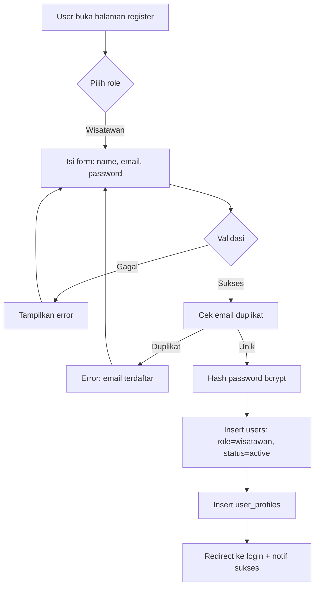

### 2.2 Registrasi Tour Guide

```mermaid
flowchart TD
    A[User buka halaman register] --> B{Pilih role}
    B -->|Tour Guide| C[Isi form: name, email, password]
    C --> D{Validasi}
    D -->|Gagal| E[Tampilkan error] --> C
    D -->|Sukses| F[Hash password bcrypt]
    F --> G[Insert users: role=tour_guide, status=pending]
    G --> H[Insert tour_guides: is_verified=0]
    H --> I[Redirect ke dashboard guide]
    I --> J[Tampilkan: Menunggu verifikasi]
    J --> K[Guide upload dokumen]
    K --> L[Admin review dokumen]
    L -->{Approve?}
    L -->|Ya| M[is_verified=1, status=active]
    L -->|Tidak| N[status=banned + alasan]
    M --> O[Notifikasi: Terverifikasi]
    N --> P[Notifikasi: Ditolak]
```

### 2.3 Login

```mermaid
flowchart TD
    A[User input email + password] --> B[Cari user by email]
    B -->{User ada?}
    B -->|Tidak| C[Error: email tidak terdaftar]
    B -->|Ya| D{password_verify}
    D -->|Tidak| E[Error: password salah]
    D -->|Ya| F{status user}
    F -->|active| G[Set session: user_id, role, name]
    F -->|banned| H[Error: akun dibanned]
    F -->|pending| I[Error: menunggu approval]
    G --> J{Redirect by role}
    J -->|admin| K[admin/dashboard]
    J -->|wisatawan| L[wisatawan/dashboard]
    J -->|tour_guide| M[tourguide/dashboard]
```

---

## 3. ALUR BOOKING TOUR GUIDE

### 3.1 Create Booking

```mermaid
flowchart TD
    A[Wisatawan pilih guide] --> B[Pilih tanggal & durasi]
    B --> C[Hitung biaya]
    C --> D{durasi >= 8 jam?}
    D -->|Ya| E[total = ceil durasi/8 × daily_rate]
    D -->|Tidak| F[total = durasi × hourly_rate]
    E --> G[Cek jadwal guide tersedia]
    F --> G
    G -->{Tersedia?}
    G -->|Tidak| H[Error: tanggal sudah dibooking]
    G -->|Ya| I[Generate booking code]
    I --> J[Insert bookings: status=pending]
    J --> K[Generate transaction code]
    K --> L[Insert transactions: payment_status=pending]
    L --> M[Update booking.transaction_id]
    M --> N[Notifikasi ke guide: Booking Baru]
    N --> O[Redirect ke halaman pembayaran]
```

### 3.2 Pembayaran & Verifikasi

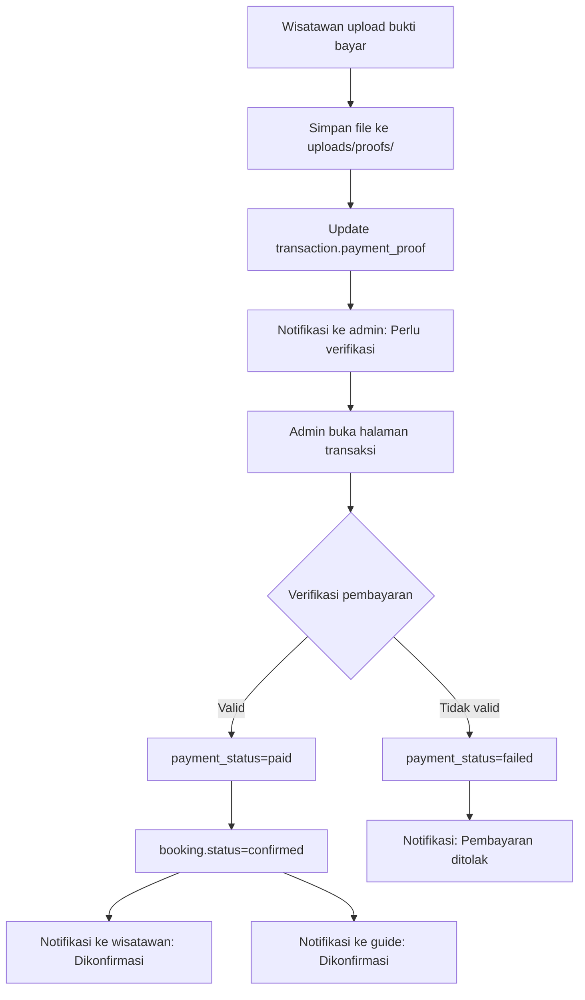

### 3.3 Guide Accept/Reject

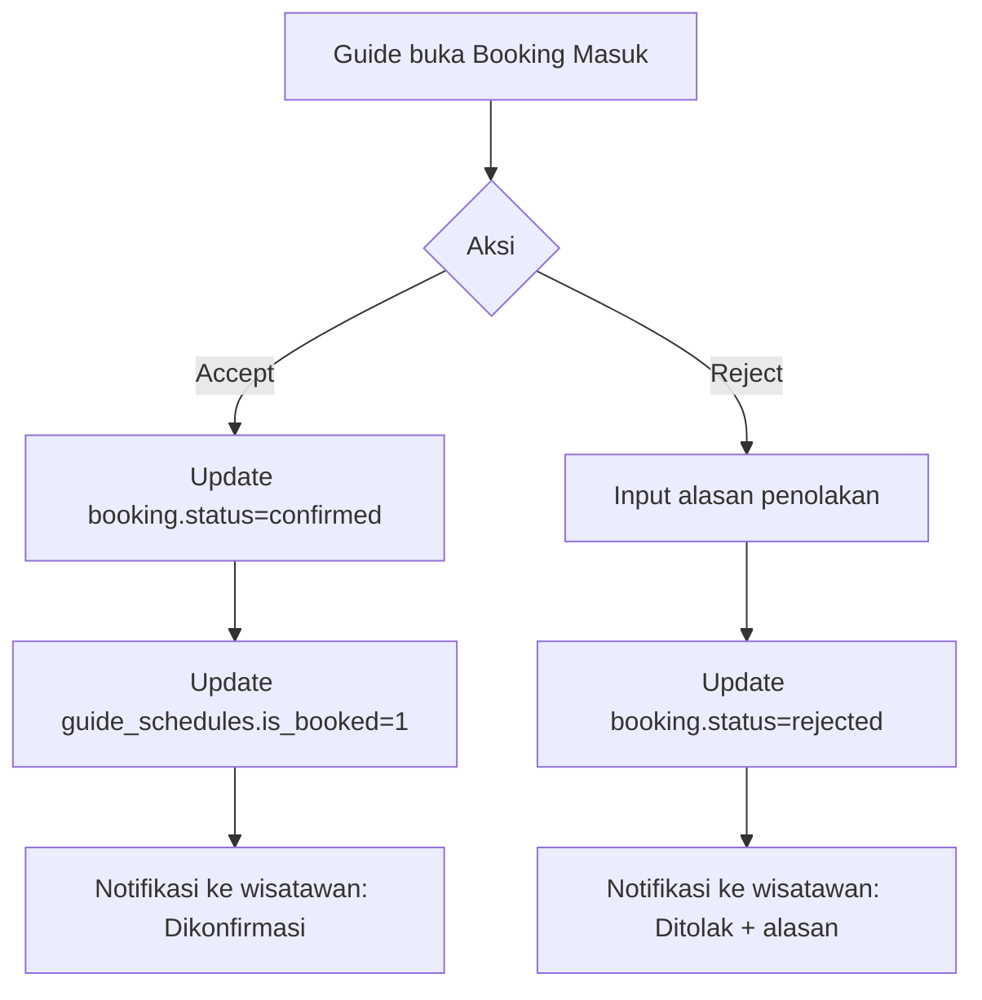

### 3.4 Complete Booking

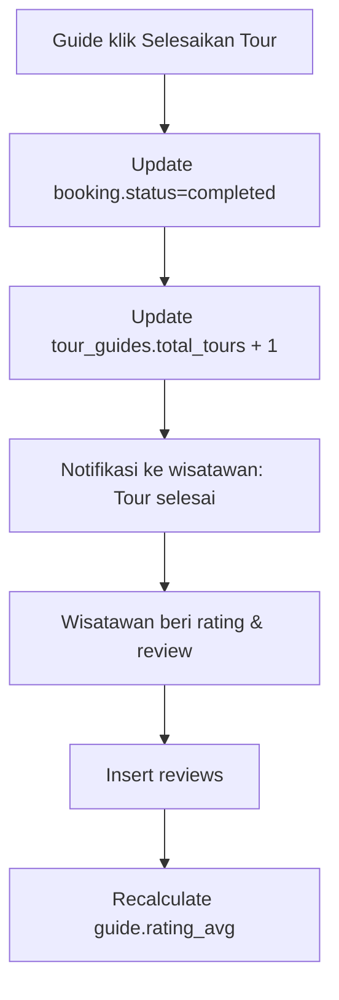

### 3.5 Cancel Booking

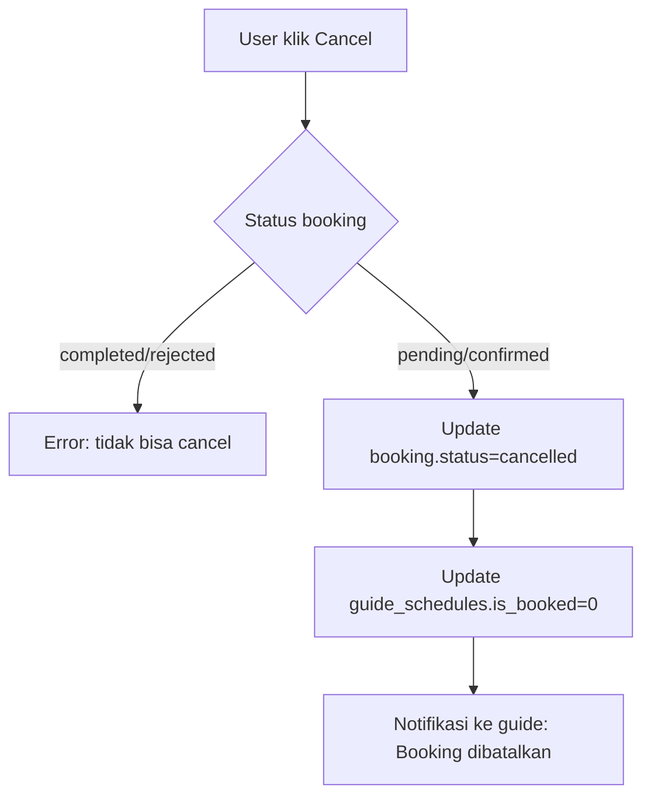

---

## 4. ALUR PEMBELIAN TIKET

```mermaid
flowchart TD
    A[Wisatawan pilih destinasi] --> B[Pilih jenis tiket & jumlah]
    B --> C[Pilih tanggal kunjungan]
    C --> D[Cek kuota harian]
    D -->{Kuota cukup?}
    D -->|Tidak| E[Error: kuota penuh]
    D -->|Ya| F[Hitung total = price × quantity]
    F --> G[Generate order code: TG-TKT-YYYYMMDD-XXX]
    G --> H[Insert ticket_orders: status=pending]
    H --> I[Insert ticket_order_items]
    I --> J[Create transaction: payment_status=pending]
    J --> K[Upload bukti bayar]
    K --> L[Admin verifikasi]
    L -->{Valid?}
    L -->|Ya| M[payment_status=paid, order.status=paid]
    M --> N[Generate QR code]
    N --> O[E-ticket siap]
    L -->|Tidak| P[payment_status=failed]
```

### 4.1 Verifikasi Tiket di Lokasi

```mermaid
flowchart TD
    A[Admin/Guide input/scan kode tiket] --> B[Cari ticket_order by code]
    B -->{Tiket ada?}
    B -->|Tidak| C[Error: tidak ditemukan]
    B -->|Ya| D{Status tiket}
    D -->|used| E[Error: sudah digunakan]
    D -->|paid/confirmed| F[Update status=used]
    F --> G[Sukses: tiket valid]
    D -->|pending/cancelled| H[Error: tiket tidak valid]
```

---

## 5. ALUR BOOKING HOTEL

```mermaid
flowchart TD
    A[Wisatawan cari hotel] --> B[Filter: city, type, tanggal]
    B --> C[Pilih hotel]
    C --> D[Lihat detail + kamar tersedia]
    D --> E[Pilih kamar & jumlah]
    E --> F[Input check-in & check-out]
    F --> G[Hitung nights = checkOut - checkIn]
    G --> H[total = price_per_night × num_rooms × nights]
    H --> I{Kamar cukup?}
    I -->|Tidak| J[Error: kamar tidak tersedia]
    I -->|Ya| K[Generate booking code]
    K --> L[Insert hotel_bookings: status=pending]
    L --> M[Create transaction: payment_status=pending]
    M --> N[Upload bukti bayar]
    N --> O[Admin verifikasi]
    O -->{Valid?}
    O -->|Ya| P[status=confirmed]
    O -->|Tidak| Q[status=failed]
    P --> R[Check-in → checked_in]
    R --> S[Check-out → checked_out]
    S --> T[Wisatawan review hotel]
```

---

## 6. ALUR PESAN RESTORAN

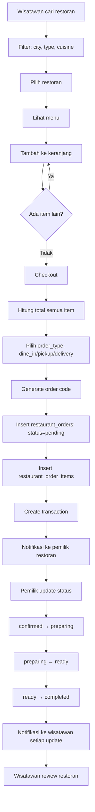

---

## 7. ALUR EVENT & PENDAFTARAN

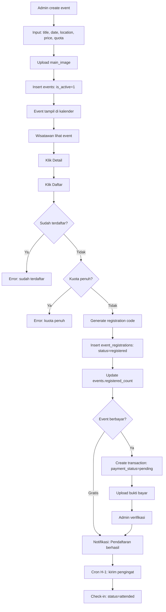

---

## 8. ALUR AI TOUR GUIDE

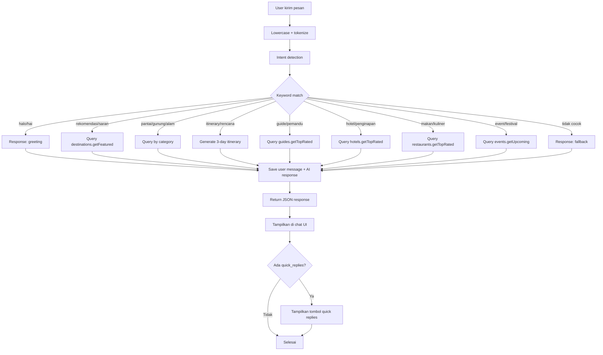

---

## 9. ALUR NOTIFIKASI

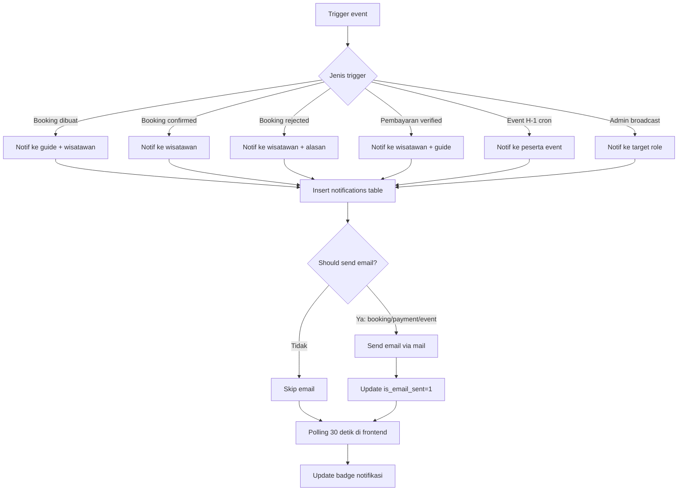

---

## 10. ALUR ADMIN APPROVAL

### 10.1 Guide Approval

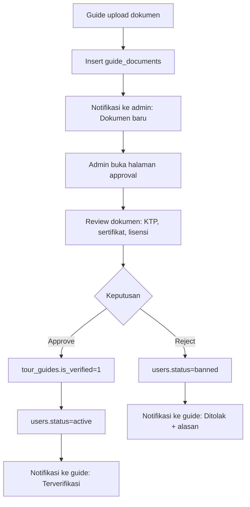

### 10.2 Hotel/Restoran Approval

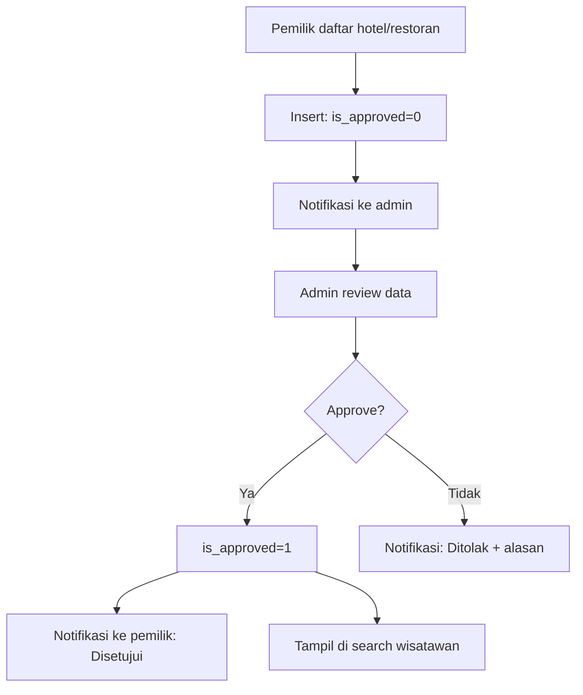

---

## 11. ALUR PAYMENT VERIFICATION (ADMIN)

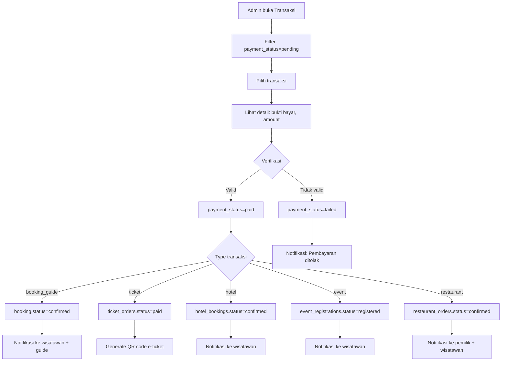

---

## 12. ALUR BACKUP DATABASE

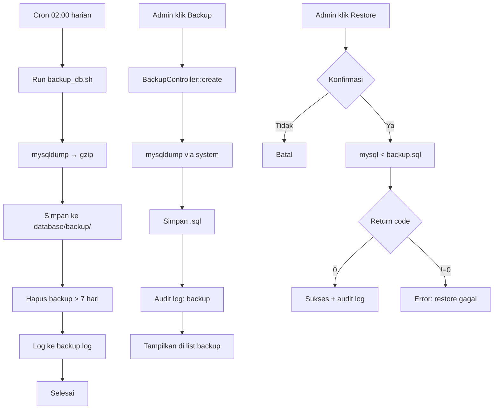

---

## 13. ALUR SESSION MANAGEMENT

```mermaid
flowchart TD
    A[Setiap request] --> B[Session::start]
    B --> C[Set cookie: HttpOnly, Secure, SameSite]
    C --> D[Cek last_regeneration]
    D -->{> 30 menit?}
    D -->|Ya| E[session_regenerate_id true]
    D -->|Tidak| F[Cek last_activity]
    E --> F
    F -->{> 30 menit idle?}
    F -->|Ya| G[session_destroy]
    G --> H[Redirect ke login]
    F -->|Tidak| I[Update last_activity]
    I --> J[Lanjut request]
```

---

## 14. ALUR RATE LIMITING

```mermaid
flowchart TD
    A[API request masuk] --> B[RateLimiter::check]
    B --> C[Key = user_id _ api]
    C --> D[Count requests last 60 detik]
    D -->{Count >= 60?}
    D -->|Ya| E[HTTP 429: Rate limit exceeded]
    D -->|Tidak| F[Insert rate_limits record]
    F --> G[Lanjut proses request]
```

---

## 15. ALUR FILE UPLOAD

```mermaid
flowchart TD
    A[User upload file] --> B{error?}
    B -->|Ya| C[Throw: Upload error]
    B -->|Tidak| D{size > 5MB?}
    D -->|Ya| E[Throw: File terlalu besar]
    D -->|Tidak| F{Type allowed?}
    F -->|Tidak| G[Throw: Tipe tidak diizinkan]
    F -->|Ya| H[Generate filename: random 32 hex]
    H --> I[move_uploaded_file]
    I --> J{Sukses?}
    J -->|Ya| K[Return path]
    J -->|Tidak| L[Throw: Gagal menyimpan]
```

---

> **Modul Selanjutnya:** `31_KAMUS_ISTILAH_GLOSARIUM.md` — Kamus istilah lengkap
