# MODUL 41 — VISUAL DIAGRAMS

> **Versi:** 1.0 · **Tanggal:** 2026-06-30

---

## 1. RINGKASAN

Kumpulan diagram visual untuk aplikasi Tour Guide dalam format Mermaid dan deskripsi untuk diagram tools.

---

## 2. ARCHITECTURE DIAGRAM

### 2.1 System Architecture

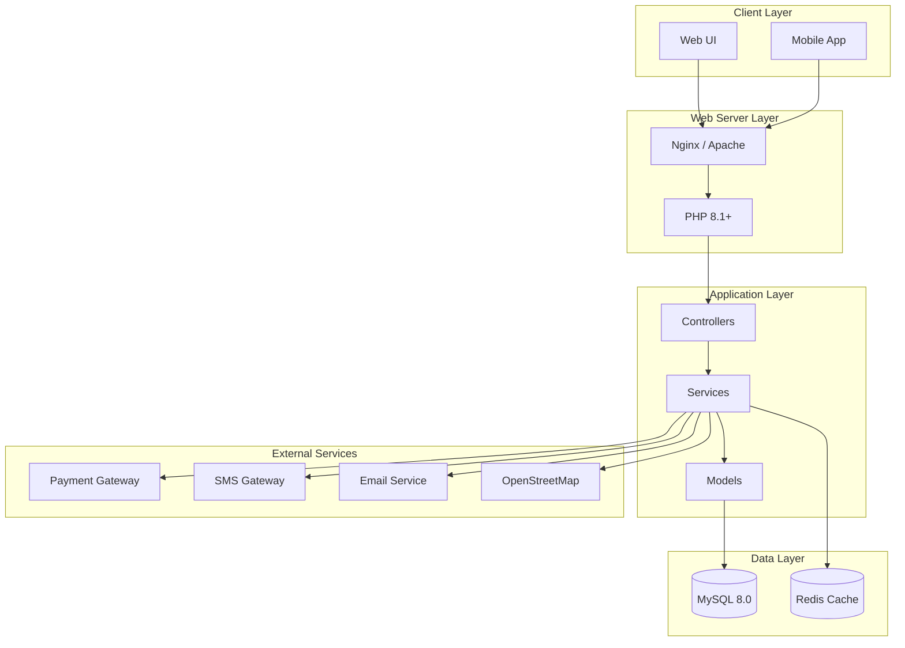

---

## 3. DATABASE ERD

### 3.1 Core Tables ERD

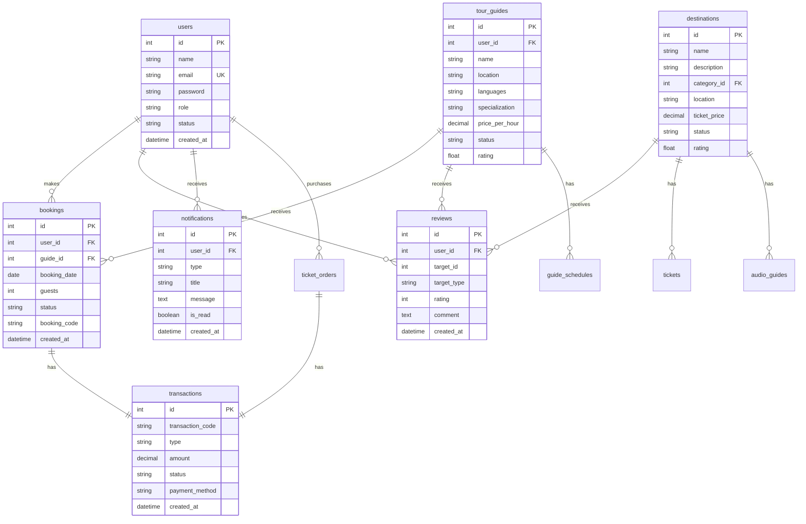

---

## 4. FLOW DIAGRAMS

### 4.1 Booking Flow

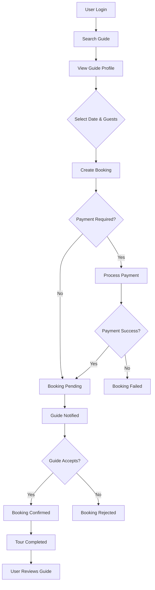

### 4.2 Ticket Purchase Flow

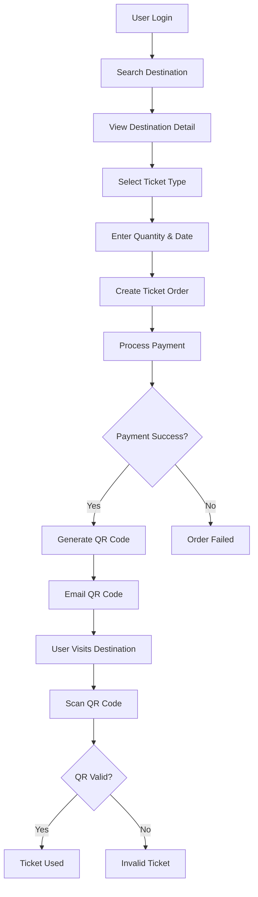

### 4.3 Authentication Flow

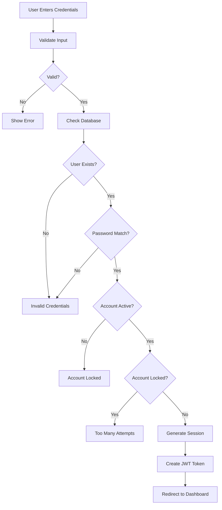

---

## 5. SEQUENCE DIAGRAMS

### 5.1 Booking Sequence

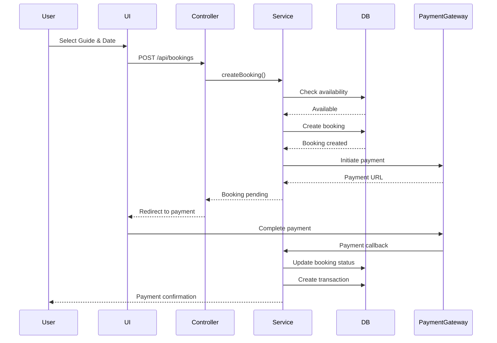

### 5.2 Authentication Sequence

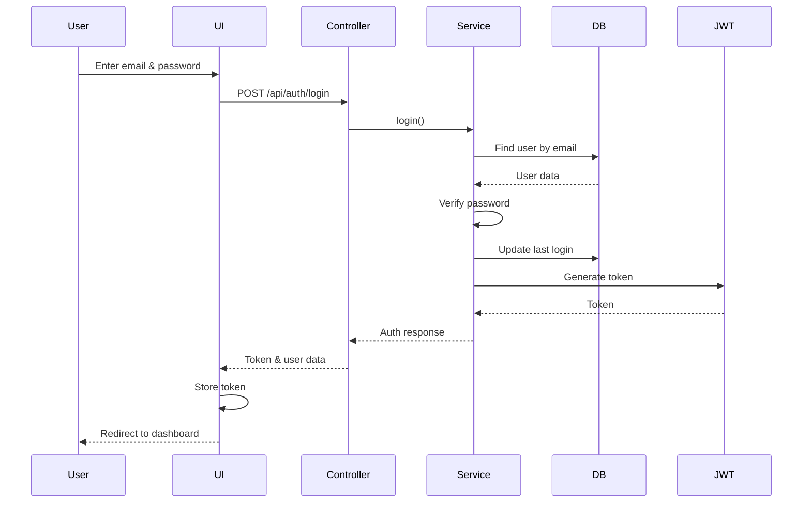

---

## 6. COMPONENT DIAGRAMS

### 6.1 MVC Architecture

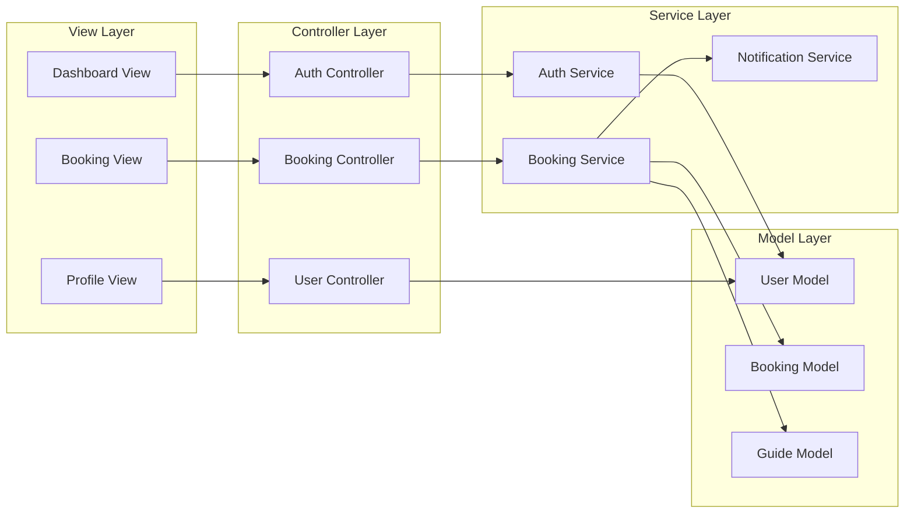

---

## 7. DEPLOYMENT DIAGRAM

### 7.1 Production Deployment

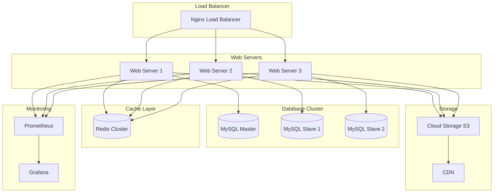

---

## 8. STATE DIAGRAMS

### 8.1 Booking State Machine

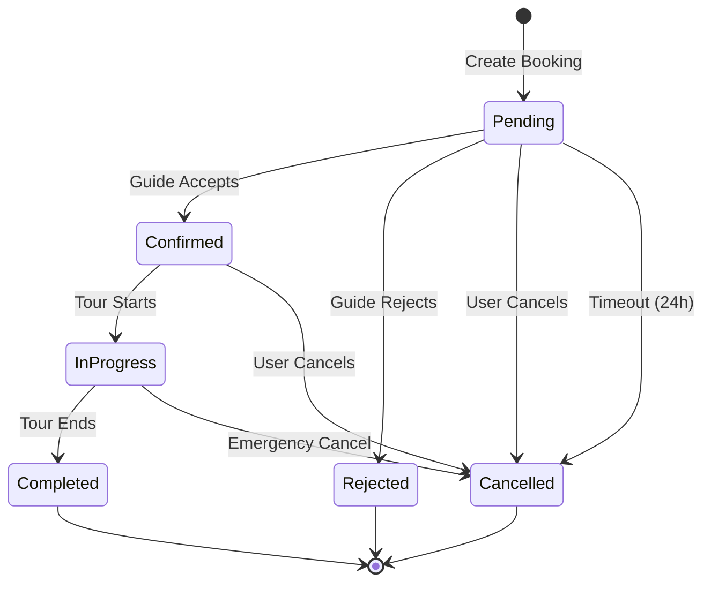

### 8.2 Transaction State Machine

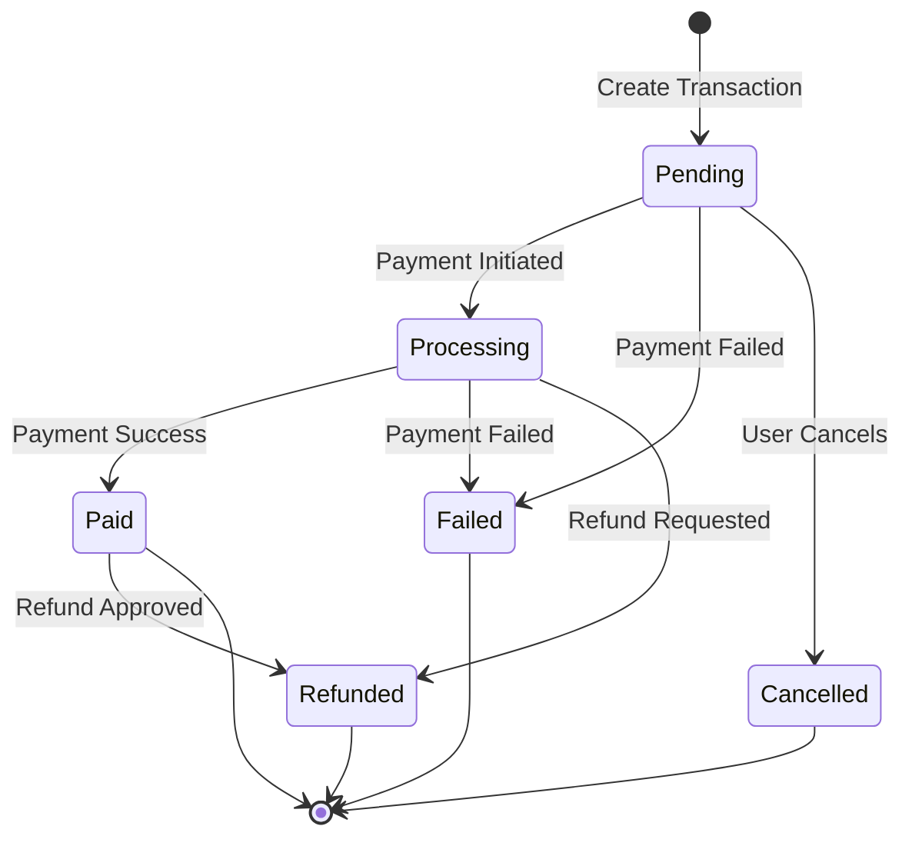

---

## 9. CLASS DIAGRAMS

### 9.1 Core Classes

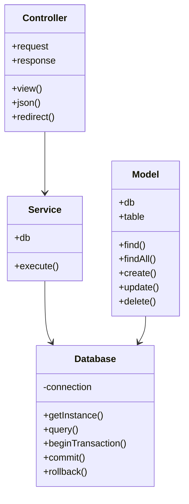

---

## 10. NETWORK DIAGRAM

### 10.1 Network Topology

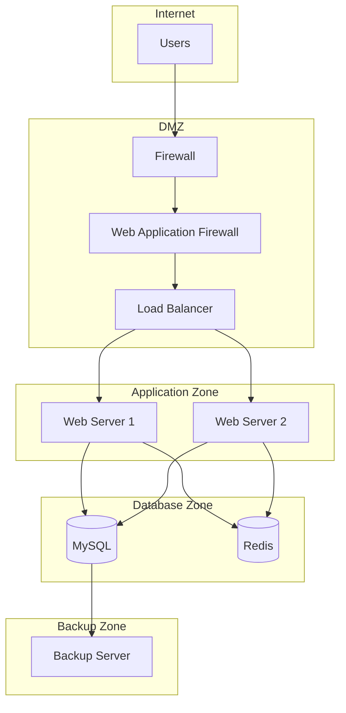

---

## 11. TIMELINE DIAGRAMS

### 11.1 Development Timeline

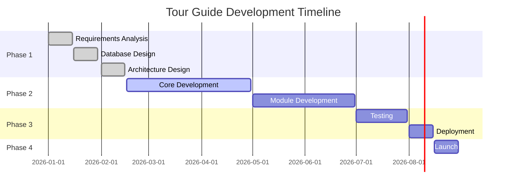

---

## 12. DIAGRAM TOOLS

### 12.1 Recommended Tools

| Tool | Purpose | Platform |
|------|---------|----------|
| **Mermaid** | Text-to-diagram | Web, VS Code |
| **draw.io** | Professional diagrams | Web, Desktop |
| **Lucidchart** | Enterprise diagrams | Web |
| **PlantUML** | UML diagrams | Desktop |
| **Graphviz** | Graph visualization | Desktop |

### 12.2 Mermaid Editor

**Online Editor:** https://mermaid.live/

**VS Code Extension:**
1. Install "Markdown Preview Mermaid Support" extension
2. Open .md file with Mermaid code
3. Preview with Ctrl+Shift+V

### 12.3 draw.io

**Online:** https://app.diagrams.net/

**Desktop:**
```bash
# Download draw.io desktop
wget https://github.com/jgraph/drawio-desktop/releases/download/v14.6.13/drawio-amd64-14.6.13.deb
sudo dpkg -i drawio-amd64-14.6.13.deb
```

---

## 13. EXPORTING DIAGRAMS

### 13.1 Export from Mermaid

```bash
# Using mermaid-cli
npm install -g @mermaid-js/mermaid-cli
mmdc -i input.mmd -o output.png
mmdc -i input.mmd -o output.svg
mmdc -i input.mmd -o output.pdf
```

### 13.2 Export from draw.io

1. Open diagram in draw.io
2. File → Export As
3. Select format (PNG, SVG, PDF)
4. Set resolution
5. Click Export

---

## 14. DIAGRAM STANDARDS

### 14.1 Naming Conventions

- Use clear, descriptive names
- Follow consistent naming across diagrams
- Use standard abbreviations (DB, API, UI, etc.)
- Include version numbers

### 14.2 Color Coding

| Color | Meaning |
|-------|---------|
| Blue | User/Client |
| Green | Database/Storage |
| Orange | External Services |
| Purple | Security |
| Gray | Infrastructure |

### 14.3 Layout Guidelines

- Left-to-right flow for processes
- Top-to-bottom for hierarchies
- Consistent spacing
- Avoid crossing lines
- Use grouping for related components

---

## 15. MAINTENANCE

### 15.1 Version Control

- Store diagram source files in Git
- Use descriptive commit messages
- Tag major diagram versions
- Document changes in commit history

### 15.2 Review Process

- Review diagrams before publishing
- Get stakeholder approval
- Document review feedback
- Update diagrams based on feedback

### 15.3 Updates

- Update diagrams when architecture changes
- Keep diagrams in sync with code
- Document diagram changes
- Communicate updates to team

---

## 16. RESOURCES

### 16.1 Documentation

- Mermaid Docs: https://mermaid-js.github.io/mermaid/
- draw.io Docs: https://www.diagrams.net/doc/
- UML Standards: https://www.uml.org/

### 16.2 Templates

- System Architecture Template
- Database ERD Template
- Flowchart Template
- Sequence Diagram Template

---

> **End of Documentation**
